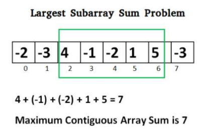

# Maximum Sum Subarray

You are given a one dimensional array that may contain both positive and negative integers, find the sum of contiguous subarray of numbers which has the largest sum. For example, if the given array is {-2, -5, 6, -2, -3, 1, 5, -6}, then the maximum subarray sum is 7.

### Input Format

The first line consists of number of test cases T. Each test case consists of two lines.

The first line of each testcase contains a single integer N denoting the number of elements for the
array A.

The second line of each testcase contains N space separated integers denoting the elements of the
array.

### Constraints

```
1 <= N <= 100000
1 <= t <= 20
-100000000 <= A[i] <= 100000000
```

### Output Format

Output a single integer denoting the maximum subarray sum for each testcase in a new line.

### Sample Input

```
2
4
1 2 3 4
3
-10 5 10
```

### Sample Output

```
10
15
```

### Explanation

For the first testcase, maximum subarray sum is generated by the entire array - 1+2+3+4 = 10
For the second testcase , maximum subarray sum is generated by the subarray {5,10} - 5+10 = 15



A simple solution is to iterate through all the elements of the array. For every element, calculate the max contiguous subarray sum starting from that element itself.

**Time Complexity** : O(n^2)

An efficient way is to use **Kadane's Algorithm.** Kadane's algorithm is a Dynamic Programming approach to find the largest sum of contiguous subarray with runtime of O(n). Simple idea of the Kadane's algorithm is to look all positive contiguous segments of the array. And keep track of maximum sum contiguous segment among all positive segments.

**Algorithm** :

1. Take two variables one for storing local max sum (max-ending-here) and global max sum (max-so-far).
2. Iterate over each element of the array say a.

```
2.1 max_ending_here = max_ending_here + a[i]
2.2 if(max_ending_here < 0>)
      max_ending_here = 0
2.3 if(max_so_far < max_ending_here)
      max_so_far = max_ending_here
```

3. max-so-far is the required max sum of contiguous subarray.

### Time Complexity
