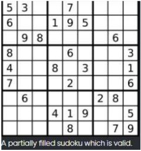

# Sudoku Checker

Determine if a 9x9 Sudoku board is valid. Only the filled cells need to be validated according to the following rules:

- Each row must contain the digits 1-9 without repetition.
- Each column must contain the digits 1-9 without repetition.
- Each of the 9 3x3 sub-boxes of the grid must contain the digits 1-9 without repetition.

Valid Sudoku :


### Input Format

```
81 space separated integers representing the values of Sudoku board.
```

### Constraints

Note:

- A Sudoku board (partially filled) could be valid but is not necessarily solvable.
- Only the filled cells need to be validated according to the mentioned rules.
- The given board contain only digits 1-9 and the character '.'
- The given board size is always 9x9

### Output Format

```
Return a boolean value, true or false.
```

### Sample Input

```
5 3 . . 7 . . . .
6 . . 1 9 5 . . .
. 9 8 . . . . 6 .
8 . . . 6 . . . 3
4 . . 8 . 3 . . 1
7 . . . 2 . . . 6
. 6 . . . . 2 8 .
. . . 4 1 9 . . 5
. . . . 8 . . 7 9
```

### Sample Output

```
true
```

### Explanation

**Algorithm** :

- One could use box_index = (row / 3) \* 3 + col / 3 where / is an integer division, row is a row number, and col is a column number.
- One could just track all values which were already encountered in a hash map value -> count.
- Move along the board
- Check for each cell value if it was seen already in the current row / column / box :
  - Return false if yes
  - Keep this value for a further tracking if no.
- Return true

### Time Complexity

O(1) since all we do here is just one iteration over the board with 81 cells.
